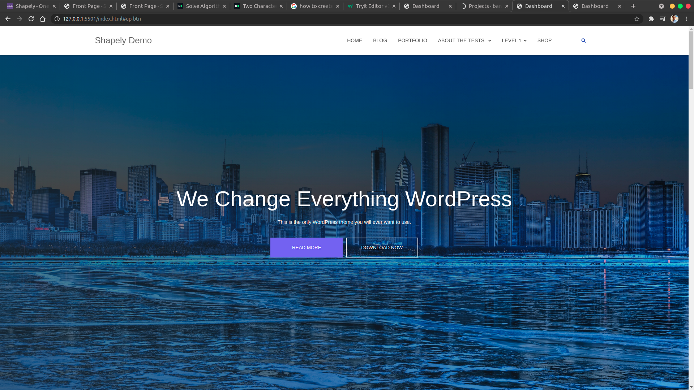

# ShapelyDemo

## Description

- "ShapelyDemo" is a powerful and versatile one page WordPress theme with pixel perfect design and outstanding functionality. It is by far the most advanced free WordPress theme available today with loads of unmatched customization options. This theme comes with several homepage widgets that can be used to add portfolio, testimonials, parallax sections, your product or service information, call for action and much more.

||    Screenshot   ||
|-|---------------------------------|-|
||||

This website was designed with the tools below:

## Built With

- HTML
- CSS Grid
- SASS
- JavaScript(DOM)

## Live Demo

[Visit the website](https://benmukebo.github.io/ShapelyDemo/)

## Getting Started

**If you want to get the local copy of the project in your local computer you just need to clone the repository by running the following command. `git clone https://github.com/BenMukebo/ShapelyDemo.git` if you have git already install on your computer.**

## Author

👤 **Ben Mukebo**

- [GitHub](https://github.com/BenMukebo)
- [LinkedIn](https://www.linkedin.com/in/kasongo-mukebo-ben-591720205/)
- [Twitter](https://twitter.com/)

## 🤝 Contributing

Contributions, [issues](https://github.com/BenMukebo/ShapelyDemo/issues), and feature requests are welcome!

## Show your support

Give a ⭐️ if you like this project!❤️❤️❤️

## Acknowledgments

- [Colorlib](https://colorlib.com/)

